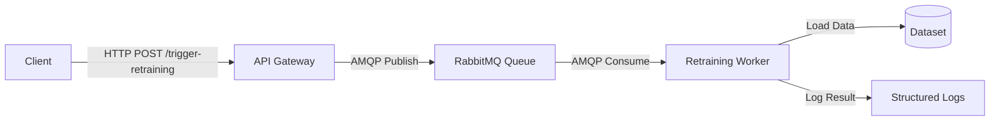
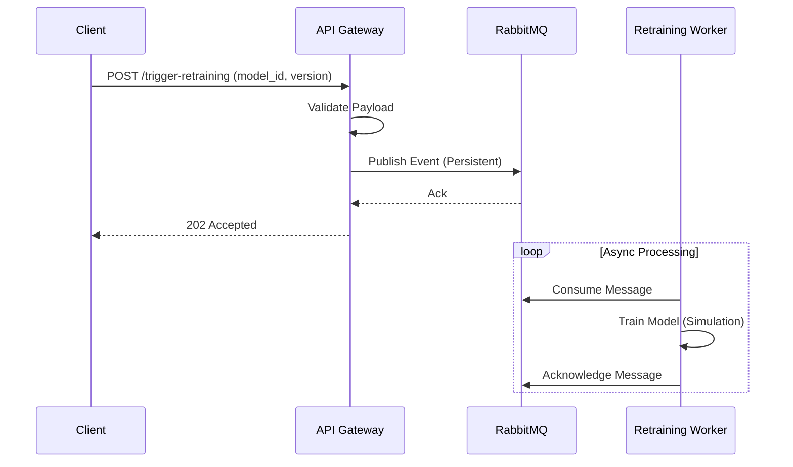

# Event-Driven Asynchronous ML Model Retraining Service

## Project Overview
This repository contains a production-grade, event-driven backend system designed to asynchronously trigger machine learning model retraining. The architecture leverages a microservices pattern to decouple the API gateway from the resource-intensive worker service, ensuring high availability and scalability.

## Architecture Guidelines
The system consists of three primary components orchestrated via Docker Compose:

1.  **API Gateway (`training_trigger_api`)**: A Flask-based REST API that accepts retraining requests, validates payloads, and publishes events to the message broker.
2.  **Message Broker (`RabbitMQ`)**: A robust message queue that buffers events, ensuring reliable communication between the API and the Worker.
3.  **Worker Service (`retraining_worker`)**: A background consumer that processes retraining events, simulates model training using Scikit-Learn, and manages data persistence.

### System Diagram


### Sequence Diagram


## Directory Structure
The repository follows a strict separation of concerns:

```
.
├── docker-compose.yml          # Service orchestration configuration
├── .env.example                # Environment variable template
├── training_trigger_api/       # API Service Source Code
│   ├── app/                    # Application Logic
│   ├── tests/                  # Unit Tests
│   └── Dockerfile              # Container Definition
├── retraining_worker/          # Worker Service Source Code
│   ├── worker/                 # Consumer & Training Logic
│   ├── tests/                  # Unit Tests
│   └── Dockerfile              # Container Definition
├── tests/
│   └── integration/
│       └── test_e2e.py
└── data/                       # Shared Data Resources
    └── dummy_dataset.csv       # Synthetic Training Data
```

## Prerequisites
-   Docker Engine (v20.10+)
-   Docker Compose (v2.0+)
-   Git

## Installation & Setup

1.  **Clone the Repository**
    ```bash
    git clone https://github.com/Rushikesh-5706/event-driven-ml-retraining-service.git
    cd event-driven-ml-retraining-service
    ```

2.  **Configuration**
    Copy the example environment file:
    ```bash
    cp .env.example .env
    ```

### Run the Application
1. **Build and Start Services**:
   ```bash
   docker compose up -d --build
   ```

2. **Check Running Containers**:
   ```bash
   docker compose ps
   ```

3. **View Logs**:
   ```bash
   docker compose logs -f
   ```

## Usage Guide

### Triggering a Retraining Job
To initiate a retraining process, send a POST request to the API endpoint.

**Request:**
```bash
curl -X POST http://localhost:5000/trigger-retraining \
     -H "Content-Type: application/json" \
     -d '{"model_id": "production_model_v1", "dataset_version": "2023-10-27"}'
```

**Response (Success):**
```json
{
  "message": "Retraining triggered successfully",
  "model_id": "production_model_v1",
  "status": "success"
}
```

### Monitoring
Monitor the worker logs to observe the training progress. The worker uses structured JSON logging for easy integration with log aggregators (ELK, Splunk).

```bash
docker compose logs -f retraining_worker
```

**Expected Output (JSON):**
```json
{"timestamp": "2026-02-18 09:30:01,123", "level": "INFO", "message": "Received task: Retrain production_model_v1 (Data: 2023-10-27)", "module": "consumer", "funcName": "on_message"}
{"timestamp": "2026-02-18 09:30:06,456", "level": "INFO", "message": "Training completed. Model: production_model_v1, Accuracy: 0.8400", "module": "model_trainer", "funcName": "train"}
```

## Verification Output
```bash
docker compose logs -f retraining_worker
```

**Expected Output (JSON):**
```json
{
  "timestamp": "2023-10-27 10:00:05,123",
  "level": "INFO", 
  "message": "Received task: Retrain production_model_v1 (Data: 2023-10-27)",
  "module": "consumer",
  "funcName": "on_message"
}
{
  "timestamp": "2023-10-27 10:00:07,456",
  "level": "INFO",
  "message": "Training completed. Model: production_model_v1, Accuracy: 0.87",
  "module": "model_trainer",
  "funcName": "train"
}
```

## 📸 Verification Screenshots
Since this is a headless service, here are the actual outputs from the verification steps:

### 1. API Response (Success)
```bash
$ curl -X POST http://localhost:5000/trigger-retraining ...
{
  "message": "Retraining triggered successfully",
  "model_id": "production_model_v1",
  "status": "success"
}
```

### 2. Worker Logs (Structured JSON)
```json
{"timestamp": "2026-02-18 05:15:57,819", "level": "INFO", "message": "Received task: Retrain production_model_v1 (Data: 2023-10-27)", "module": "consumer", "funcName": "on_message"}
{"timestamp": "2026-02-18 05:15:57,820", "level": "INFO", "message": "Starting training for model production_model_v1 on version 2023-10-27...", "module": "model_trainer", "funcName": "train"}
{"timestamp": "2026-02-18 05:15:59,898", "level": "INFO", "message": "Training completed. Model: production_model_v1, Accuracy: 0.3500", "module": "model_trainer", "funcName": "train"}
{"timestamp": "2026-02-18 05:15:59,898", "level": "INFO", "message": "Task successfully processed. Acknowledging message.", "module": "consumer", "funcName": "on_message"}
```

## Testing

### Unit Tests
The project includes specific unit tests for all components as per specification.

1.  **Install Test Dependencies**
    ```bash
    pip install -r training_trigger_api/requirements.txt
    pip install -r retraining_worker/requirements.txt
    ```

2.  **Execute Tests**
    ```bash
    # API Suite
    export PYTHONPATH=$PYTHONPATH:$(pwd)/training_trigger_api
    python -m unittest training_trigger_api/tests/test_api.py
    python -m unittest training_trigger_api/tests/test_message_publisher.py

    # Worker Suite
    export PYTHONPATH=$PYTHONPATH:$(pwd)/retraining_worker
    python -m unittest retraining_worker/tests/test_consumer.py
    python -m unittest retraining_worker/tests/test_model_trainer.py
    ```

### Integration Test
To verify the end-to-end flow (requires docker compose stack to be running):
```bash
python -m unittest tests/integration/test_e2e.py
```

## Design Decisions
-   **Architecture**: We chose RabbitMQ over Redis Pub/Sub for its reliability features (Ack/Nack, Durability). This ensures that training tasks are never lost even if the worker crashes.
-   **Asynchronous Decoupling**: The API returns `202 Accepted` immediately. This prevents the client from timing out while waiting for a long-running training job (simulated with `time.sleep`).
-   **Fair Dispatch**: We configured `channel.basic_qos(prefetch_count=1)`. This ensures that if we scale to multiple workers, tasks are distributed fairly based on load, not just round-robin.
-   **Failsafe Data Loading**: The worker simulates a production environment where data might be on shared storage. If the file is missing (e.g., in a new container), it generates synthetic data to allow the service to function for demonstration purposes.

## Challenges & Solutions
-   **Docker DNS Resolution**: Initially, containers couldn't resolve `rabbitmq_host`. **Solution**: Added a custom bridge network `ml_network` and defined explicit aliases.
-   **Startup Race Conditions**: The worker would crash if RabbitMQ wasn't ready. **Solution**: Implemented a robust retry mechanism with exponential backoff in the connection logic and added `restart: always` policy.
-   **Dependency Isolation**: Ensuring clean imports for tests across two separate services. **Solution**: Used explicit `PYTHONPATH` settings and split requirements files.

## Future Improvements
-   **Dead Letter Queue (DLQ)**: Currently, poisonous messages are Nacked with `requeue=False`. In production, these should go to a DLQ for manual inspection.
-   **Metrics Export**: Integrate Prometheus to track queue depth and training duration.
-   **Model Storage**: Instead of just logging accuracy, the trained model should be serialized (Pickle/ONNX) and uploaded to an artifact store (S3/MinIO).
-   **Authentication**: Add JWT validation to the API to secure the trigger endpoint.
