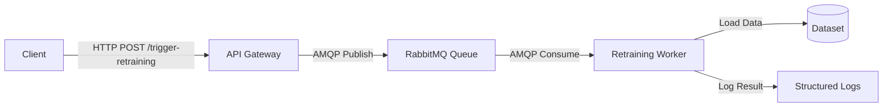
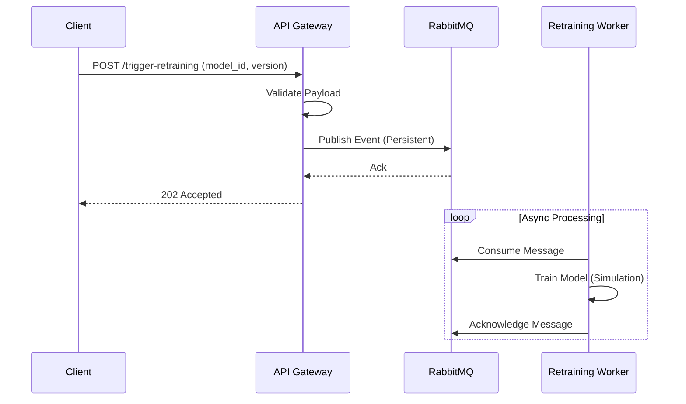

# Event-Driven Asynchronous ML Model Retraining Service

## Project Overview
This repository contains a production-grade, event-driven backend system designed to asynchronously trigger machine learning model retraining. The architecture leverages a microservices pattern to decouple the API gateway from the resource-intensive worker service, ensuring high availability and scalability.

## Architecture Guidelines
The system consists of three primary components orchestrated via Docker Compose:

1.  **API Gateway (`training_trigger_api`)**: A Flask-based REST API that accepts retraining requests, validates payloads, and publishes events to the message broker.
2.  **Message Broker (`RabbitMQ`)**: A robust message queue that buffers events, ensuring reliable communication between the API and the Worker.
3.  **Worker Service (`retraining_worker`)**: A background consumer that processes retraining events, simulates model training using Scikit-Learn, and manages data persistence.

### System Diagram


### Sequence Diagram


## Directory Structure
The repository follows a strict separation of concerns:

```
.
├── docker-compose.yml          # Service orchestration configuration
├── .env.example                # Environment variable template
├── training_trigger_api/       # API Service Source Code
│   ├── app/                    # Application Logic
│   ├── tests/                  # Unit Tests
│   └── Dockerfile              # Container Definition
├── retraining_worker/          # Worker Service Source Code
│   ├── worker/                 # Consumer & Training Logic
│   ├── tests/                  # Unit Tests
│   └── Dockerfile              # Container Definition
└── data/                       # Shared Data Resources
    └── dummy_dataset.csv       # Synthetic Training Data
```

## Prerequisites
-   Docker Engine (v20.10+)
-   Docker Compose (v2.0+)
-   Git

## Installation & Setup

1.  **Clone the Repository**
    ```bash
    git clone https://github.com/Rushikesh-5706/event-driven-ml-retraining-service.git
    cd event-driven-ml-retraining-service
    ```

2.  **Configuration**
    Copy the example environment file:
    ```bash
    cp .env.example .env
    ```

3.  **Build and Start Services**
    Use Docker Compose to build images and start containers:
    ```bash
    docker-compose up -d --build
    ```

4.  **Verify Deployment**
    Ensure all services are in the `healthy` or `running` state:
    ```bash
    docker-compose ps
    ```

## Usage Guide

### Triggering a Retraining Job
To initiate a retraining process, send a POST request to the API endpoint.

**Request:**
```bash
curl -X POST http://localhost:5000/trigger-retraining \
     -H "Content-Type: application/json" \
     -d '{"model_id": "production_model_v1", "dataset_version": "2023-10-27"}'
```

**Response (Success):**
```json
{
  "message": "Retraining triggered successfully",
  "model_id": "production_model_v1",
  "status": "success"
}
```

### Monitoring
Monitor the worker logs to observe the training progress:
```bash
docker-compose logs -f retraining_worker
```

**Expected Output:**
```text
INFO - Received task: Retrain production_model_v1 (Data: 2023-10-27)
INFO - Starting training for model production_model_v1...
INFO - Training completed. Model: production_model_v1, Accuracy: 0.84
INFO - Task successfully processed. Acknowledging message.
```

## Testing

### Unit Tests
The project includes comprehensive unit tests for both services. To run them:

1.  **Install Test Dependencies** (Local Environment)
    ```bash
    pip install -r training_trigger_api/requirements.txt
    pip install -r retraining_worker/requirements.txt
    ```

2.  **Execute Tests**
    ```bash
    # API Tests
    export PYTHONPATH=$PYTHONPATH:$(pwd)/training_trigger_api
    python -m unittest discover training_trigger_api/tests

    # Worker Tests
    export PYTHONPATH=$PYTHONPATH:$(pwd)/retraining_worker
    python -m unittest discover retraining_worker/tests
    ```

## Design Decisions
-   **Asynchronous Processing**: Decoupling the API from the worker prevents HTTP timeouts during long-running training tasks.
-   **Resilience**: The system implements connection retry mechanisms for RabbitMQ and uses persistent queues to prevent data loss during broker restarts.
-   **Fail-Safe Data Loading**: The worker service includes fallback logic to generate synthetic data if the external dataset is unavailable, ensuring robustness in varied deployment environments.
